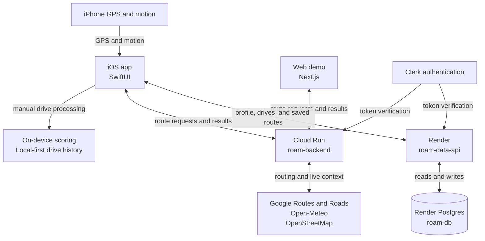

# Roam

Roam is an iPhone driving coach for families helping a new driver build real experience. It gives them a clearer view of a route before leaving, then turns recorded practice drives into feedback they can actually use.

The project includes the native iOS app, a web route-planning demo, and the backend services that power route scoring and account sync.

## Features

The iPhone app is organized into four tabs:

- **Routes** is where a driver plans a trip. It scores the route, explains the difficult parts, compares alternatives and departure times, checks the route against recorded experience, and can queue it for practice.
- **Drive** runs a manually started driving session. It shows live speed, time, and distance, records GPS and phone motion, flags events such as hard braking or sharp cornering, and keeps past drives available for review.
- **Progress** turns qualifying drives into a longer-term view of the driver's experience. It tracks measured miles, after-dark driving, faster-road exposure, weekly activity, and a route-adjusted coaching score.
- **Profile** holds the driver's name and licensing stage, driving insights, appearance settings, and account controls. Signed-in users can also back up their profile, saved routes, and drive history.

Roam also supports shared routes from Apple Maps and Google Maps, a Live Activity during an active drive, and a CarPlay dashboard for viewing the current session.

## How it works

For route planning, Roam sends the start, destination, and departure time to its route-analysis service. The service combines route geometry, maneuvers, traffic-aware timing, daylight, weather, and available road data. It returns a difficulty score along with the reasons, hotspots, confidence, and alternate routes behind it.

Drive recording stays local-first. The iOS app uses CoreLocation and CoreMotion to reject weak GPS readings, measure changes in speed and direction, and identify coaching events. Qualifying drives feed the Progress and readiness views, while signed-in users can sync their saved data through the separate data API.

## Tech and deployment

The iOS app is built with SwiftUI. The web demo uses Next.js, and the backend is an Express and TypeScript service. That backend is deployed twice with different responsibilities:

Cloud Run handles route difficulty and departure comparisons without a database. Render is created from `render.yaml`; it runs database migrations when the service starts and connects `roam-data-api` to the managed `roam-db` Postgres instance. Keeping the two deployments separate lets route scoring stay stateless while account data remains behind an authenticated API.

## ROAM Sense hardware prototype — bill of materials

ROAM Sense is a planned Tier 2 hardware extension: a fixed IMU and dedicated GNSS receiver would stream measurements over Bluetooth LE to the iPhone app. The goal is to compare fixed-sensor measurements with phone-only recording. Hardware assembly, firmware, iOS integration, calibration, and any accuracy improvement still need implementation and validation.

The separate **[BOM.csv](BOM.csv)** lists the parts for one USB-powered prototype, with purchase quantities, exact product links, USD unit prices, line totals, and sourcing notes. The parts subtotal is **$136.58**, using prices checked on **September 2, 2026**. A **$180 planning budget** leaves $43.42 for tax, shipping, and price changes; that allowance is an estimate, not a checkout quote. Full retail packs are included for fasteners and mounting tape. Tools, an iPhone, and a development computer are outside this materials budget.

The selected [ESP32 Feather V2](https://www.adafruit.com/product/5400), [ISM330DHCX](https://www.adafruit.com/product/4502), and [PA1010D](https://www.adafruit.com/product/4415) support a shared 3.3 V STEMMA QT/I2C connection using the two listed cables. Firmware must enable the Feather's switched sensor power supply. The GPS and Bluetooth antennas are included on their respective boards. USB power comes through the listed car adapter and USB-C cable. This prototype does not require a battery, OBD-II connection, or custom PCB.

The enclosure needs a cable opening and matching board mounting holes; its existing M4 mounting bosses do not match the M2.5 hardware. Final fit, mounting security, cable routing, and GNSS reception need physical checks. Keep the device clear of airbags and the driver's view. The GPS antenna needs a clear sky-facing position, and a dedicated receiver alone does not establish better accuracy than an iPhone.
